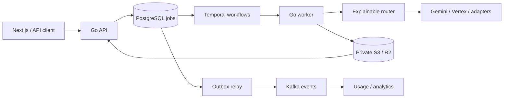

# Open Flow

**A Gemini-first, open-source AI media gateway.** Bring your own provider credentials, generate images and videos, and understand how each request is routed.

> Early foundation (M0). The runnable Go API and Next.js workspace are available. Credential management, provider calls, image/video generation and smart routing are tracked work; they are not implemented yet.

## Why Open Flow?

Media providers differ in model discovery, credentials, asynchronous operations and failure behavior. Open Flow is designed to normalize them behind a provider adapter contract, make long-running jobs durable, keep credentials server-side, and expose one versioned API.

Google Gemini is the primary provider. Vertex AI, fal, Replicate and Hugging Face are planned integrations. Only provider-permitted credentials and quotas are supported.

## Quick start

Requirements: Node.js 24 LTS, pnpm 11.25.0 and Go 1.27+.

```sh
git clone https://github.com/Lord-shaban/open-flow.git
cd open-flow
pnpm install --frozen-lockfile
pnpm dev
```

In another terminal, run `cd services/api` then `go run ./cmd/api`.

Open http://localhost:3000; check http://127.0.0.1:8080/healthz. No API keys are required. See [development](docs/development.md) for checks and Docker setup.

## Architecture



The diagram describes the target system. M0 implements the web entry point, HTTP foundation, provider/event interfaces, a Temporal probe workflow and Kafka/Temporal smoke commands. Keep core modules cohesive while practicing Temporal orchestration and Kafka event delivery from day one.

## Repository

| Path | Purpose |
| --- | --- |
| `apps/web` | Next.js App Router, TypeScript and Tailwind |
| `services/api` | Go HTTP service and provider contracts |
| `api` | Versioned OpenAPI contract |
| `docs` | Architecture, ADRs, providers, deployment and backlog |
| `infra` | Docker development configuration |
| `scripts` | Repository quality and GitHub planning helpers |

## Roadmap and contributions

[Project plan](docs/project-plan.md) · [GitHub Issues](https://github.com/Lord-shaban/open-flow/issues) · [Milestones](https://github.com/Lord-shaban/open-flow/milestones)

M0 foundation → M1 Gemini images → M2 video and resilience → M3 provider routing → M4 production hardening.

Read [CONTRIBUTING](CONTRIBUTING.md), [architecture](docs/architecture.md), [adding a provider](docs/providers/adding-a-provider.md), [API](docs/api.md) and [Gemini setup](docs/providers/gemini.md). Use a focused issue and PR; CI never makes paid provider calls.

## Security and license

Never commit credentials. Report vulnerabilities through [SECURITY.md](SECURITY.md). Open Flow is licensed under [MIT](LICENSE).
