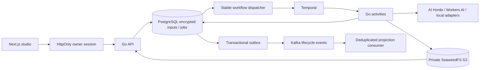

# Open Flow

**A free-first image studio and system-design learning project.** Create images through AI Horde without an account or card, or connect your own free Cloudflare Workers AI account. Kafka and Temporal run locally alongside PostgreSQL and private SeaweedFS object storage.

M1 implements owner access, encrypted credentials, verified model discovery, durable image generation, private downloads and a responsive creative workspace inspired by [Google Flow](https://flow.google). Video and automatic routing remain later milestones. Gemini image generation is disabled because it requires paid billing.

## Start the full studio

Install Docker Compose, Node.js 24 and pnpm 11.25.0. Go 1.27 is needed only when running backend processes outside Docker.

```sh
git clone https://github.com/Lord-shaban/open-flow.git
cd open-flow
pnpm install --frozen-lockfile
pnpm setup:local
docker compose --env-file .env -f infra/compose.yaml --profile app up -d --build
```

Open http://localhost:3000 and unlock with `OPEN_FLOW_OWNER_TOKEN` from the generated, ignored `.env` file. Setup never overwrites existing secrets. AI Horde needs no provider key. Choose **Training canvas · Not AI** for entirely local procedural images, or configure optional ComfyUI for local AI inference.

Infrastructure is self-hosted open-source software; no managed subscription, billing account or card is required. Your machine supplies compute, disk and electricity. Hosted free providers have limits, queues and privacy policies: see [free providers](docs/providers/free-providers.md). Cloudflare requires a Workers Free account without a payment method; Open Flow cannot verify the billing plan of an arbitrary existing account.

For UI-only development, run `pnpm dev`. Generation requires the full stack. See [development](docs/development.md) for setup, checks and recovery exercises.

## Implemented architecture



Submission intent is committed once before contacting a provider. An unknown acceptance enters `reconciliation_required`; it never triggers automatic resubmission, provider fallback or key cycling. Prompts and provider credentials remain encrypted in PostgreSQL; Temporal history and Kafka events contain IDs and coarse states.

## Repository and roadmap

| Path           | Purpose                                                                            |
| -------------- | ---------------------------------------------------------------------------------- |
| `apps/web`     | Next.js App Router, TypeScript, Tailwind and accessible Radix primitives           |
| `services/api` | Go API, adapters, Temporal worker, dispatcher, Kafka relay/consumer and storage GC |
| `api`          | Versioned OpenAPI contract                                                         |
| `docs`         | Architecture, ADRs, providers, operations and backlog                              |
| `infra`        | Local Docker Compose infrastructure                                                |

[Project plan](docs/project-plan.md) · [Issues](https://github.com/Lord-shaban/open-flow/issues) · [Milestones](https://github.com/Lord-shaban/open-flow/milestones)

M0 foundation → M1 free image studio → M2 video/resilience → M3 routing → M4 production hardening. Future integrations must meet the user's free/no-card requirement before activation.

Read [CONTRIBUTING](CONTRIBUTING.md), [architecture](docs/architecture.md), [API](docs/api.md), [durable pipeline](docs/persistence.md) and [adding a provider](docs/providers/adding-a-provider.md). CI uses fixtures and a procedural adapter; it never calls paid image endpoints. Report vulnerabilities through [SECURITY](SECURITY.md). Licensed under [MIT](LICENSE).
