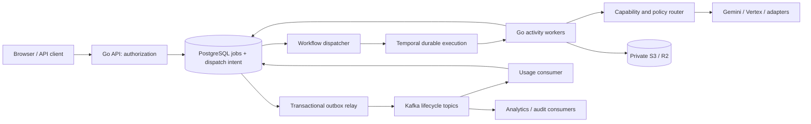
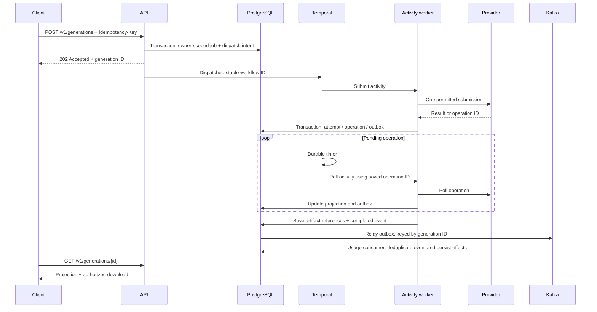

# Architecture

Status: target architecture with Kafka and Temporal required for system-design training. M0 implements HTTP foundation, provider/event contracts, a Temporal probe workflow and Kafka/Temporal smoke commands; media generation is planned.

## Modules and responsibilities

Next.js is the web client. A Go module supplies independent API, Temporal worker and later outbox/consumer processes. PostgreSQL is the application source of truth. Temporal owns durable orchestration. Kafka owns lifecycle event distribution and replay. S3/R2 owns private artifacts.

## Durable generation flow

## Correctness boundaries

Database acceptance and Temporal start are separate commits. Persist dispatch intent then retry starting a deterministic workflow ID with explicit conflict/reuse policy. Do not return a new job when an owner-scoped idempotency key already exists; different payload is 409.

Activities are at least once. Submission may produce an external side effect before a timeout; persist intent, use provider idempotency if supported, disable unsafe submission retries and enter reconciliation_required when acceptance is unknown. A crash between provider acceptance and operation persistence is not solved by Temporal. Persist operation identifiers and resume polling, never resubmit to recover a pending video.

Workflow code is deterministic: no I/O, wall-clock, randomness or goroutines outside SDK constructs. Use activities, SDK timers, workflow-safe concurrency and patch/versioning for changes. Use continue-as-new if polling history grows; cancellation distinguishes request, provider support and confirmed completion.

Job states: queued, submitting, running, reconciliation_required, cancel_requested, succeeded, failed, canceled. Terminal transitions must be monotonic and owned. Events and provider metadata never carry plaintext keys. Temporal history carries IDs; fetch prompts and credentials inside activities to avoid persisted sensitive payloads.

## Event delivery

Transactional outbox bridges state changes and Kafka. Publish at least once; consumers persist event IDs with effects before committing offsets. Partition by aggregate ID for per-job ordering; there is no global ordering. Include schema version, event ID, generation ID, event type, aggregate sequence and occurrence timestamp. Handle duplicate/out-of-order events explicitly, and bound poison-message retries with audited dead-letter/redrive behavior. Do not log prompts or signed media links.

## Routing, security and scaling

Filter owner-authorized credentials, verified image/video capabilities, region, configured allowlists and available health/quota signals before scoring. Default Gemini-first. Unknown cost/quota is explicit; route reasons and exclusions are persisted. Auth, billing, policy or project quota errors never cause key cycling. Only explicit authorized fallback after a known safe failure; ambiguous acceptance never fails over automatically.

Credentials require authenticated encryption with owner/provider AAD and versioned wrapping keys, plus authorization before ingestion. Objects are private and downloads short-lived. Restrict media fetch hosts, byte/MIME limits and telemetry cardinality.

API, workers, dispatch/relay and Kafka consumer groups can scale independently. Exercises will measure queue backlog, workflow latency, consumer lag, outbox age and provider concurrency. M0 Compose is a single-node learning environment, not production HA. See the ADRs and `docs/system-design-labs.md`.
